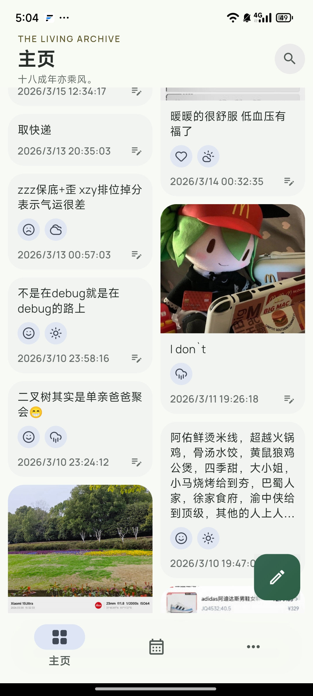
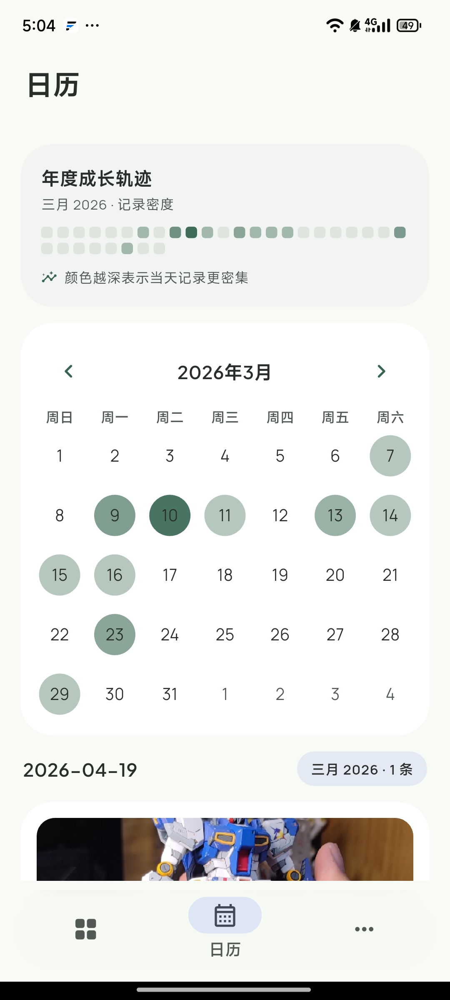
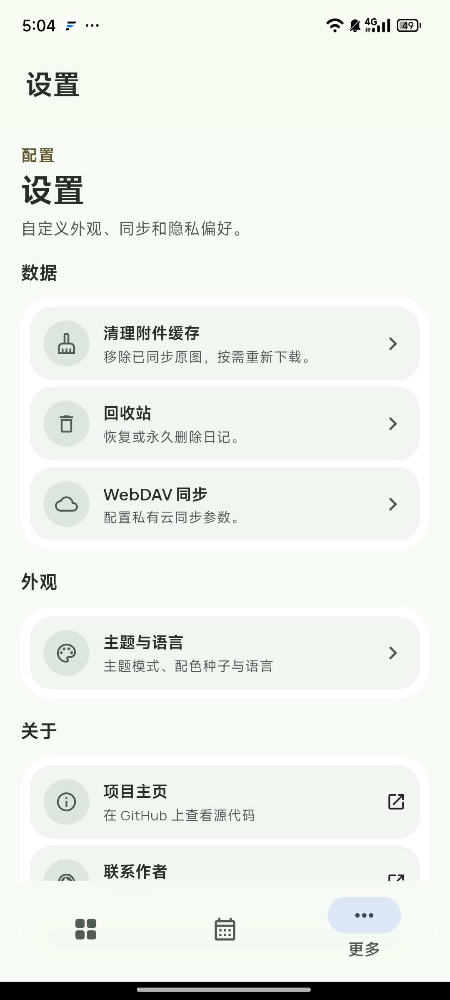

# 📔 Dav Diary

### 基于 Flutter 的智能增量同步日记应用

**Dav Diary** 是一款兼顾"隐私主权"与"极致书写"的日记应用。数据归用户所有，通过 **WebDAV** 协议实现无缝增量备份，配合 **Material 3** 的灵动设计，提供最纯粹的记录空间。

  

    
    
    
  

## ☁️ 使用教程

以[坚果云](https://www.jianguoyun.com/)为例，官方提供每月 1GB 上传流量、3GB 下载流量，无限空间且下载不限速。

1. [生成应用授权密码](https://help.jianguoyun.com/?p=2064)
2. 回到 App 设置中配置 WebDAV 即可

## ✨ 核心特性

### 🖋️ 沉浸式创作中心 (Powered by Quill)

不仅是文字，更是生活的全维度还原：

- **全能富文本：** 支持加粗、斜体、三级标题 (H1-H3)、引用块及对齐方式。
- **多媒体融合：** 无缝嵌入高清图片，内置**矢量手绘涂鸦**组件，记录灵感瞬间。
- **元数据感官：** 自动抓取创作时的**地理位置、天气、心情**，并支持回溯修改。

### 🎨 灵动设计 (Material 3)

- **自适应配色：** 全面适配 **Material You (Dynamic Color)**，界面色彩随壁纸律动。
- **多维回顾：** 瀑布流卡片预览与**热力图日历**并行，让往事有迹可循。
- **丝滑交互：** 全程 120fps 高刷体验，底部导航栏支持滑动手势切换，关键操作伴有触感反馈。
- **字体美学：** 标题使用 Plus Jakarta Sans，正文使用 Manrope，排版层次分明。

### ☁️ WebDAV 智能增量同步

针对移动端优化的高效同步策略：

- **分块校验机制：** 基于时间戳与文件哈希，仅同步变更条目，节省流量与时间。
- **冲突决策：** 智能合并多端数据，支持"最后写入者胜"或"保留副本"模式。
- **隐私至上：** 数据直连你的私有云（如坚果云、Nextcloud），不经过任何第三方服务器。

### 📊 心情趋势图

利用 `fl_chart` 库，根据用户记录的心情和天气生成周/月报表，展示情绪波动曲线。

### 🌐 多语言支持

内置中文、English 双语界面，跟随系统或手动切换。

### 📝 每日一言

每日自动获取精选语录，可开关控制。

## 🛠️ 技术架构

| **模块**       | **关键技术**                                       |
| -------------- | -------------------------------------------------- |
| **UI 框架**    | Flutter (Dart)                                     |
| **状态管理**   | Provider                                           |
| **编辑器核心** | `flutter_quill` 深度定制                           |
| **本地存储**   | SQLite (sqflite) + SharedPreferences               |
| **网络层**     | Dio & webdav_client                                |
| **图表**       | fl_chart                                           |
| **日历**       | table_calendar                                     |
| **字体**       | Google Fonts (Plus Jakarta Sans / Manrope)         |
| **图标**       | Lucide Icons                                       |
| **国际化**     | intl + flutter_localizations                       |

## 🚀 性能表现

- **离线优先 (Offline-First)：** 核心逻辑在本地完成，后台静默同步，无网络时依然操作自如。
- **大图优化：** 智能缩略图生成与懒加载技术，确保列表滚动不掉帧。

## 📅 开发计划 (Roadmap)

- [ ] **端到端加密 (E2EE)：** 在上传至 WebDAV 前进行本地加密，确保云端数据绝对安全。
- [ ] **多端同步优化：** 桌面端 (Windows/macOS) 适配。
- [ ] **AI 助手：** 基于本地模型的周报总结与心情分析。

## 🤝 参与贡献

欢迎提交 Issue 或 Pull Request 来完善 Dav Diary。
