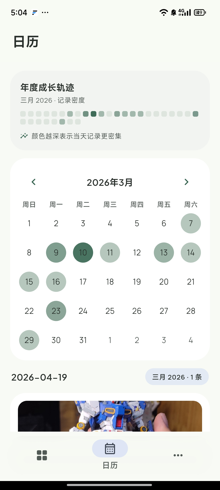
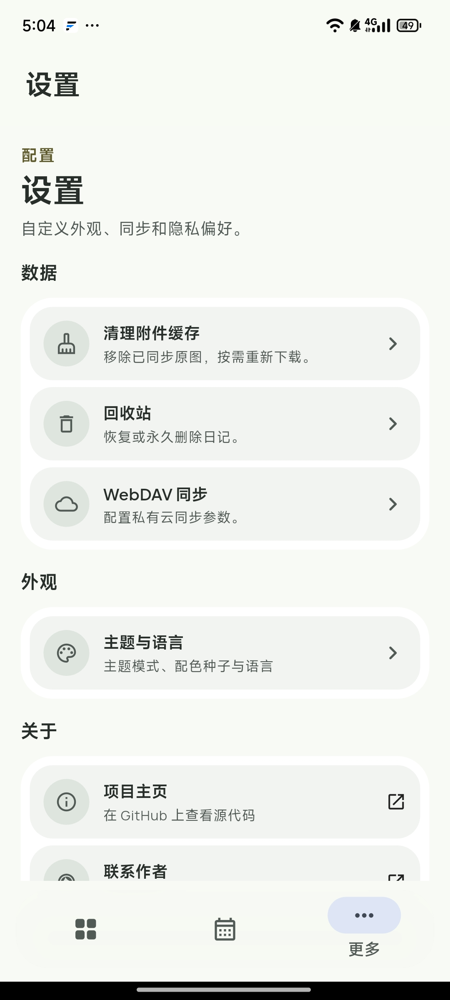

<p align="center">
  
</p>

<h1 align="center">Kidiary</h1>

<p align="center">
  <a href="./LICENSE"></a>
  
  
</p>
<p align="center">
  基于 Flutter 的智能增量同步日记应用,简单够用
</p>

**Dav Diary** 是一款兼顾"隐私主权"与"极致书写"的日记应用。数据归用户所有，通过 **WebDAV 或 S3 对象存储** 实现无缝增量备份，配合 **Material 3** 的灵动设计，提供最纯粹的记录空间。

<div style="text-align: center;">
  <div style="display: inline-flex; gap: 20px;">
    
    
    
  </div>
</div>

## ☁️ 使用教程

以[坚果云](https://www.jianguoyun.com/)为例，官方提供每月 1GB 上传流量、3GB 下载流量，无限空间且下载不限速。

1. [生成应用授权密码](https://help.jianguoyun.com/?p=2064)
2. 回到 App 设置中配置 WebDAV 即可

### S3 对象存储

在「设置 → 云同步」中将同步方式切换为 **S3**，填写：

- **Endpoint**：服务的完整 HTTP(S) 地址，例如 `https://s3.us-east-1.amazonaws.com`，不包含 Bucket 或对象路径。
- **Bucket**：已创建的存储桶名称。应用不会创建或删除存储桶。
- **Region**：服务商要求的签名区域；默认 `us-east-1`，需要 `auto` 的服务请填写 `auto`。
- **Access Key ID / Secret Access Key**：具有此前缀列出、读取、写入、删除权限的访问密钥。
- **对象前缀**：默认 `diary`，可留空以使用桶根目录。
- **路径式访问**：默认开启；服务要求 Bucket 子域名访问时关闭。

点击「保存并测试连接」检查此前缀的列出权限，再点击「立即同步」。读写及删除权限会在实际同步时使用。较大附件可能使用分段上传，需要对应权限。当前采用长期访问密钥，不支持需要 Session Token 的临时凭证。

WebDAV 和 S3 的配置分别保留，每次使用一个同步目标。切换目标前会下载旧目标中尚未缓存的原附件；下载失败时保留原配置。首次同步新目标会重新核对全部日记，删除待办按目标隔离。密钥不写入同步文件或普通配置 JSON，沿用应用现有的本机凭据保存机制。

使用 MinIO Dart 客户端接入 S3 兼容 API，复用日记增量同步、冲突策略、缩略图和删除记录。自动化测试使用本地模拟 S3 服务；具体云服务和设备上的兼容性仍需使用实际账户验证。

## 🪟 Windows 桌面版

项目支持 Android 和 Windows。Windows 版沿用宽屏侧栏布局，支持富文本日记、图片附件、涂鸦、日历、回收站及 WebDAV / S3 同步。

### 运行和构建

使用 Flutter 3.38.9 / Dart 3.10.8 或兼容的更新版本。在 Windows 上安装 **Visual Studio 2022 或 2026** 的 **Desktop development with C++（使用 C++ 的桌面开发）** 工作负载，包含 MSVC、CMake 和 Windows SDK。`gal` 的 Windows 插件需要支持 C++20 的工具链；项目已移除其旧版 `/await` 选项以兼容新版 MSVC。

```powershell
flutter doctor -v
flutter pub get
flutter run -d windows
flutter build windows --release
```

发布时打包整个 `build\windows\x64\runner\Release\` 目录，包括 `diary.exe`、DLL 和 `data` 文件夹。SQLite 原生库由 `sqlite3` 的构建钩子自动随应用打包，不能只分发 EXE。

### 平台行为

- 数据库、附件和缩略图保存在 `path_provider` 返回的应用支持目录（Windows 的用户应用数据目录），不占用公共“文档”目录；Android 的存储位置保持兼容。
- “选择图片文件”打开系统文件选择器；未配置桌面相机时隐藏拍照入口。涂鸦仍可使用鼠标绘制。
- 编辑日记时可按 `Ctrl+S` 保存。
- 附件预览中的“另存为”可导出图片、视频和其他文件；取消对话框不会修改附件。
- Windows 定位需要开启系统定位服务并授权；位置以经纬度保存，也可手动填写。Windows 不调用仅支持移动平台的地址解析插件。
- 视频预览使用 [video_player_win](https://pub.dev/packages/video_player_win)，可播放的格式取决于 Windows 已安装的媒体编解码器。
- 默认窗口为 1280 × 720，最小尺寸为 640 × 480，并按显示缩放比例调整；宽度不足时切换为底部导航。

### 验证

```powershell
flutter analyze
flutter test
```

Windows 上的数据库测试使用真实 SQLite，覆盖创建、持久化、回收站、版本升级和并发初始化；附件导出测试覆盖字节完整性、取消和保存到原路径。其他系统会跳过 Windows 数据库测试。已使用 Flutter 3.38.9、Visual Studio Community 2026 18.10.3 和 Windows SDK 10.0.28000.0 成功构建 Windows x64 发布版。安装包和原生功能仍需在目标设备上实际运行验证。

## ✨ 核心特性

### 🖋️ 沉浸式创作中心 (Powered by Quill)

不仅是文字，更是生活的全维度还原：

- **全能富文本：** 支持加粗、斜体、三级标题 (H1-H3)、引用块及对齐方式。
- **多媒体融合：** 无缝嵌入高清图片，内置**矢量手绘涂鸦**组件，记录灵感瞬间。
- **元数据感官：** 自动抓取创作时的**地理位置、天气、心情**，并支持回溯修改。

### 🎨 灵动设计 (Material 3)

- **自适应配色：** 全面适配 **Material You (Dynamic Color)**，界面色彩随壁纸律动。
- **多维回顾：** 瀑布流卡片预览与**热力图日历**并行，让往事有迹可循。
- **高刷新率适配：** Android 前台窗口请求当前分辨率下设备支持的最高刷新率，省电模式下交由系统决定；实际帧率取决于设备、系统设置和页面负载。页面使用轻量过渡动画，关键操作伴有触感反馈。
- **字体美学：** 标题使用 Plus Jakarta Sans，正文使用 Manrope，排版层次分明。

### ☁️ WebDAV 智能增量同步

针对移动端优化的高效同步策略：

- **分块校验机制：** 基于时间戳与文件哈希，仅同步变更条目，节省流量与时间。
- **冲突决策：** 智能合并多端数据，支持"最后写入者胜"或"保留副本"模式。
- **隐私至上：** 数据直连你的私有云（如坚果云、Nextcloud），不经过任何第三方服务器。

### 📊 心情趋势图

利用 `fl_chart` 库，根据用户记录的心情和天气生成周/月报表，展示情绪波动曲线。

### 🌐 多语言支持

内置中文、English 双语界面，跟随系统或手动切换。

### 📝 每日一言

每日自动获取精选语录，可开关控制。

## 🛠️ 技术架构

| **模块**       | **关键技术**                                       |
| -------------- | -------------------------------------------------- |
| **UI 框架**    | Flutter (Dart)                                     |
| **状态管理**   | Provider                                           |
| **编辑器核心** | `flutter_quill` 深度定制                           |
| **本地存储**   | SQLite（移动端 sqflite / Windows sqflite_common_ffi）+ SharedPreferences |
| **网络层**     | Dio & webdav_client                                |
| **图表**       | fl_chart                                           |
| **日历**       | table_calendar                                     |
| **字体**       | Google Fonts (Plus Jakarta Sans / Manrope)         |
| **图标**       | Lucide Icons                                       |
| **国际化**     | intl + flutter_localizations                       |

## 🚀 性能表现

- **离线优先 (Offline-First)：** 核心逻辑在本地完成，后台静默同步，无网络时依然操作自如。
- **大图优化：** 智能缩略图生成与懒加载技术，确保列表滚动不掉帧。

## 📅 开发计划 (Roadmap)

- [ ] **端到端加密 (E2EE)：** 在上传至 WebDAV 前进行本地加密，确保云端数据绝对安全。
- [x] **Windows 适配：** 桌面工程、数据库、附件导出及宽屏布局。
- [ ] **macOS 适配：** 桌面端平台支持。
- [ ] **AI 助手：** 基于本地模型的周报总结与心情分析。

## 🤝 参与贡献

欢迎提交 Issue 或 Pull Request 来完善 Dav Diary。

### 页面性能验证

高刷新率窗口请求包含 Android 原生代码，需要重新构建并安装 APK，热重载不会使其生效。
使用 `flutter run --profile` 配合 DevTools Performance 面板检查滚动和页面切换；不要用 debug 模式评估实际帧率。
60 / 90 / 120 Hz 对应约 16.7 / 11.1 / 8.3 ms 的每帧预算。分别观察 UI 和 Raster 耗时及掉帧，而不是仅查看屏幕刷新率。
本次减少了工具栏实时背景模糊、限制列表及预览小图解码尺寸、缓存首页筛选结果，并延迟创建未访问标签页。没有真机测量时不承诺固定帧率。
